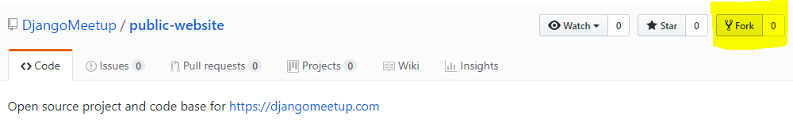
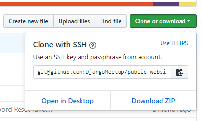
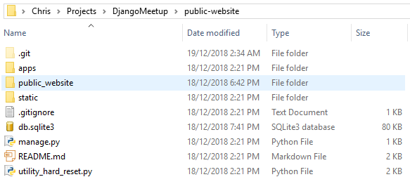

**************************************************
Download Project
**************************************************

Create A Project Folder
##################################################

Create a DjangoMeetup folder, preferably near the top level user folder on your computer.  Here’s a couple of ideas:
::

    On Linux/Mac:
    ~/projects/djangomeetup

    On Windows:
    C:\Users\Owner\Projects\DjangoMeetup

As a heads up to where we’re going, in this folder we are going to have:

(i)	the project files downloaded from the Git repository (called **public-website**).
    This folder will be referred to as the project repository folder, because it contains the .git folder.

(ii) a virtual environment, to allow future environment replication (in this guide it will be called **env**)

Get a Copy of The Project
##################################################

Fork the Project
--------------------------------------------------

Go to your browser and log in to your own GitHub account.  Then head to the `DjangoMeetup repo <https://github.com/DjangoMeetup/public-website>`_ and fork it.

After you’ve done that, head back to your own GitHub account where you’ll see that it’s been forked underneath the project name public-website.

We now need to clone that repo to the project folder on our computer.   We can do this either using HTTPS (simple), or using SSH way (slightly more involved).  Note, you only have to choose one of these approaches.

Clone to Your Computer – HTTPS
--------------------------------------------------

If you chose the HTTPS method, then you need to clone the repo address using HTTPS, which you can get from your repo, as per image below (note that your github name will appear instead of DjangoMeetup).

.. image:: ../_static/images/https_clone.png
    :align: center
    :alt: fork for Django Meetup github repo

Then use your command line tool to run the clone command (replace **USERNAME** with your github name):
::

  git clone https://github.com/**USERNAME**/public-website.git

If successful, this should have created a public-website folder within your DjangoMeetup folder.

Clone to Your Computer – SSH
--------------------------------------------------

If you chose the HTTPS way above, you can exclude this step.  Otherwise, if you prefer to use the security of SSH, then use this approach.

Note that it essentially replicates the HTTPS way, except that we need to add an SSH key.

Also, the remote links are different between HTTPS and SSH, as shown here (replace **USERNAME** with your github name):
::

    HTTPS:
    https://github.com/USERNAME/REPOSITORY.git

    SSH:
    git@github.com:USERNAME/REPOSITORY.git

Steps to Create SSH Key
**************************************************

The SSH key allows you to connect to GitHub without supplying your username or password at each visit.  These keys are kept in your ~/.ssh folder (or the .ssh folder in your home directory on Windows).

If you don’t already have SSH keys in your.ssh folder, GitHub provides an overview of creating SSH keys here: https://help.github.com/articles/connecting-to-github-with-ssh/

As a general guide, here are the required steps.

(i)	Generate the key pair (with a secure pass phrase).

  If you use the RSA protocol, these typically default to two files called:

  a.	id_rsa 		(the private key, with a secure password)

  b.	id_rsa.pub 		(the public key)

(ii)	Start the ssh-agent on your PC, and add the private key to your .ssh folder

(iii)	Add the public key to your GitHub account

  You do this by clicking on your profile pic, choosing SSH and GPS keys, New SSH, and then pasting in the contents of the public key file.

Clone via SSH
**************************************************

First we need to clone the repo address using SSH, which you can get from the repo, as per image below (note that your github name will appear instead of DjangoMeetup).

Then use your command line tool to run the full clone command (replace **USERNAME** with your github name):
::

    git clone git@github.com:USERNAME/public-website.git

If Clone was Successful
--------------------------------------------------

Within the public-website folder, you now should see a structure similar to the folder in the image (this is taken from Windows, but should be the same structure on Linux/Mac).

Note that on Windows I have enabled View, Hidden Items. This allows me to see the files with a dot prefix.

By way of clarifying terminology, what we see are the contents of the project repository root folder (ie the top **public-website** folder). 
This contains the project root folder (ie. the bottom **public-website** folder).

Within that folder are the:

* project root folder, which as mentioned above is the bottom **public-website** folder
* docs folder, which contains the source code for this guide
* manage.py file, for running django commands
* requirements folder, which contains package requirements
* .git repository
* .gitignore file, which specifies which files to keep out of git
* README.md file for the project
* utility_hard_reset.py tool for resetting the database

Add Parent Repo Address To Git
--------------------------------------------------

Ok, now lets account for modifications made to the project parent, which we will want to bring to our local copy.  In order to do that, we need to add the parent repository (albeit read-only).

Note that we’ll want to use the DjangoMeetup repo this time.  So run the following command to add the parent (or upstream) remote location:
::

    With HTTPS:
    git remote add upstream https://github.com/DjangoMeetup/public-website.git

    With SSH:
    git remote add upstream git@github.com:DjangoMeetup/public-website.git

This means we now have two git remotes for our local repository.  We can check that by running:
::

    git remote

And if you want to see the remotes and the addresses they point to, run:
::

    git remote -v

This should return the remote shortcut names of origin and parent (and addresses if you used the latter command).

Update from Parent
--------------------------------------------------

If at a later stage the upstream repository is changed and we want to bring those changes into our local repository, we can then update our local repo by running:
::

    git pull upstream master
